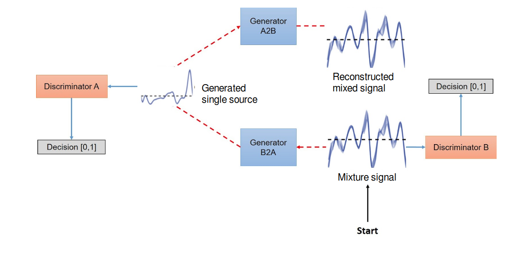

# Cycle GAN in music source separation in raw waveform domain
Research Project to extract source signals from a mixed signal without knowledge of the mixing process. It is a hard machine learning task as the input audio are correlated and some components' information are missing in the mixture, so a model is needed to recover these missing data and recover the signal component. We demonstrate that an adversarial framework with one generator competing with one discriminator can separate music signals into its components. In the context of this work, we will mainly focus on the task of separating music instruments from a multiple instruments signal (mixture).



## DataSet

MUSDB download from MUSDB18 corpus for music separation https://zenodo.org/record/1117372

```
@misc{MUSDB18,
  author       = {Rafii, Zafar and
                  Liutkus, Antoine and
                  Fabian-Robert St{\"o}ter and
                  Mimilakis, Stylianos Ioannis and
                  Bittner, Rachel},
  title        = {The {MUSDB18} corpus for music separation},
  month        = dec,
  year         = 2017,
  doi          = {10.5281/zenodo.1117372},
  url          = {https://doi.org/10.5281/zenodo.1117372}
}
```


## Lazy DataLoader
We use LMDB with protocol buffer to lazy load each waveform from the system in a fast way with low memory footprint.
In order to generate a protocol buffer with different fields inside protocol_buffer folder change datanum.proto with the new fields and run the following command:
> protoc -I=$SRC_DIR --python_out=$DST_DIR/datanum_pb2.py $SRC_DIR/datanum.proto

## Model Used 


## Jupyter Notebook
> notebook.ipynb
Includes the experiments used to train, predict and evaluate the output of the proposed framework

## Sidenote
This is an exploration project, it includes evaluation python blocks to compute SDR, SIR and SAR.
It includes a simple usage of LMDB loader and wavegan model implementation.
The results are only good in the domain of piano separation but when trained with MUSDB18, it doesn't surpass the state of the art.
However, the audio separated is in results folder and this repo is for educational purposes only.
